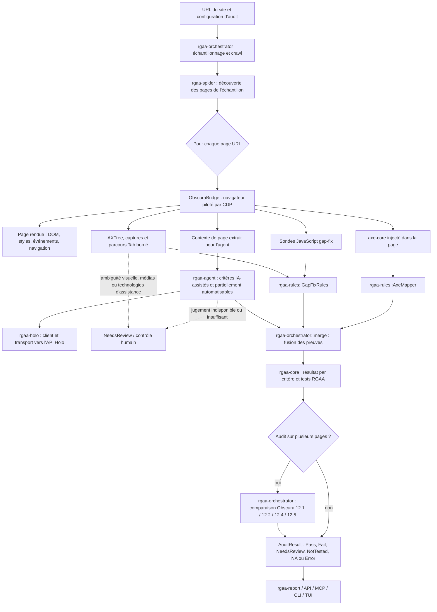

# Diagramme de traitement des 106 critères RGAA

**Référence :** checkout `rgaa-rs` après raccordement du routage et des sondes, 5 octobre 2026. Le registre `engine_plan.json` reste la source unique des moteurs principaux.

**Légende de couverture :** les 106 critères sont affectés à un moteur (13 axe-core, 53 déterministes, 32 Holo, 8 humains). Les 23 anciens « non testés » ont maintenant une sonde ou une comparaison raccordée, mais ces contrôles sont explicitement **partiels** : leur sortie peut être `Fail` ou `NeedsReview`, jamais un `Pass` de conformité. Les 8 critères humains restent manuels. Le raccordement ne certifie pas les 258 tests RGAA.

## Vue de bout en bout



### Ordre et responsabilité des composants

1. **`rgaa-orchestrator`** fixe l’échantillon et coordonne les phases de crawl et d’audit. Il lance axe, les sondes gap-fix et l’extraction du contexte par page, puis n’envoie à Holo qu’un lot dédoublonné de critères dont le moteur principal est Holo et qui restent sans verdict déterministe conclusif. Les contrôles inter-pages utilisent un lot Obscura séparé, sans appel Holo supplémentaire.
2. **`rgaa-spider`** découvre les pages à visiter. Le crawler permet un audit multi-pages, mais ne prouve pas à lui seul que l’échantillon représente tout le site.
3. **`rgaa-obscura` / Obscura / CDP** charge et rend les pages, exécute les scripts et axe-core, et observe le parcours clavier par Tab dans une session temporaire bornée. Les critères 12.8/12.9 partagent cette observation. Les captures, les gestes complexes et la compatibilité réelle avec les lecteurs d’écran restent à vérifier.
4. **`axe-core`** détecte les règles d’accessibilité pour lesquelles une règle axe est effectivement mappée. La couverture peut être partielle : un silence axe ne vaut alors jamais preuve de conformité.
5. **`rgaa-rules`** transforme les violations axe et les sorties des sondes JS en résultats RGAA. Les sondes JS peuvent faire échouer un critère ; un `Pass` requiert une couverture complète du critère/test.
6. **`rgaa-agent` + `rgaa-holo`** évaluent le sens, la pertinence ou d’autres cas qui demandent un jugement. Le pipeline filtre selon `EnginePlan`, retire les critères déjà décidés par axe/les sondes, et ne déclenche pas une seconde requête pour un identifiant absent d’une réponse Holo groupée.
7. **`rgaa-orchestrator::merge`** fusionne les résultats et garde la provenance. Une preuve déterministe est prioritaire sur le jugement du modèle ; une erreur n’est pas une preuve de conformité. Le catalogue de `rgaa-core` garantit une entrée pour chacun des 106 critères.
8. **Agrégation** : les échecs de page restent visibles dans le résultat du site. Un lot Obscura compare les signatures de navigation, la position des menus, l’accès au plan du site et l’accès à la recherche pour 12.1, 12.2, 12.4 et 12.5. Les contradictions observées peuvent échouer ; les signaux cohérents restent `NeedsReview` car la sémantique, les exceptions RGAA et l’exhaustivité du crawl ne sont pas prouvées.
9. **Sorties** : `rgaa-report`, `rgaa-api`, `rgaa-mcp`, `rgaa-cli` et `rgaa-tui` présentent ou exposent `AuditResult` ; ils ne remplacent pas les moteurs d’observation.

## Attribution des 106 critères au moteur principal

Chaque identifiant apparaît une seule fois ci-dessous, selon le moteur principal du registre exécutable `rgaa-core/data/rgaa-4.1.2/engine_plan.json` (présent dans le ZIP et le checkout). Les mécanismes secondaires peuvent aussi contribuer au même critère (par exemple axe + sonde + Holo) ; ils ne changent pas son moteur principal.

| Thème RGAA | Axe-core (A) | Déterministe / Obscura / sondes (D) | Holo / agent IA (H) | Humain (M) |
|---|---|---|---|---|
| 1. Images | 1.1 | 1.6, 1.9 | 1.2, 1.3, 1.4, 1.5, 1.7, 1.8 | — |
| 2. Cadres | 2.1 | — | 2.2 | — |
| 3. Couleurs | 3.2 | 3.3 | 3.1 | — |
| 4. Multimédia | 4.3 | 4.1, 4.5, 4.7, 4.8, 4.10, 4.11, 4.12, 4.13 | 4.9 | 4.2, 4.4, 4.6 |
| 5. Tableaux | 5.7 | 5.1, 5.4, 5.8 | 5.2, 5.3, 5.5, 5.6 | — |
| 6. Liens | 6.2 | — | 6.1 | — |
| 7. Scripts | — | 7.3, 7.4 | 7.1, 7.2 | 7.5 |
| 8. Éléments obligatoires | 8.3, 8.5 | 8.1, 8.2, 8.7, 8.9, 8.10 | 8.4, 8.6, 8.8 | — |
| 9. Structuration | 9.3 | 9.4 | 9.1, 9.2 | — |
| 10. Présentation | 10.6, 10.8 | 10.1, 10.2, 10.4, 10.5, 10.7, 10.11, 10.12, 10.13, 10.14 | 10.3, 10.9, 10.10 | — |
| 11. Formulaires | 11.1 | 11.3, 11.4, 11.5, 11.6, 11.8 | 11.2, 11.7, 11.9, 11.10, 11.11, 11.13 | 11.12 |
| 12. Navigation | 12.7 | 12.1, 12.2, 12.4, 12.5, 12.6, 12.8, 12.9, 12.10, 12.11 | 12.3 | — |
| 13. Consultation | — | 13.2, 13.3, 13.5, 13.8, 13.9, 13.10, 13.11, 13.12 | 13.6 | 13.1, 13.4, 13.7 |

**Comptage par moteur principal, tiré du registre `engine_plan.json` :** Axe-core 13, déterministe 53, Holo 32, humain 8 (106 au total).

## Lecture du statut des critères

### 75 autres critères automatisés ou assistés

Les 75 critères traités sont ceux des colonnes Axe, Déterministe et Holo **moins les 23 identifiants de la section suivante**. Les 8 critères de la colonne Humain forment la catégorie distincte « manuel ». « Traité » signifie que le moteur principal est raccordé ; cela ne prouve pas que tous les tests sont intégralement automatisés ni qu’un `Pass` est toujours permis.

### 23 critères avec sonde partielle raccordée

`1.6`, `3.3`, `4.12`, `4.13`, `8.7`, `10.9`, `10.12`, `10.13`, `11.3`, `11.8`, `11.11`, `12.1`, `12.2`, `12.4`, `12.5`, `12.8`, `12.9`, `12.10`, `12.11`, `13.3`, `13.10`, `13.11`, `13.12`.

Les sondes concernent les descriptions d’images, contrastes graphiques, médias, changements de langue, indices visuels, espacement du texte, labels et validation de formulaires, navigation clavier/pointeur, raccourcis, gestes et contenus en mouvement. Elles inventorient des indices ou détectent certains échecs ; elles ne concluent pas automatiquement à la conformité complète. Les quatre critères de portée site comparent les pages du même audit et rétrogradent un échantillon incomplet en `NeedsReview`.

### 8 manuels par conception

`4.2`, `4.4`, `4.6`, `7.5`, `11.12`, `13.1`, `13.4`, `13.7`.

Holo peut faire du pré-tri pour certains, mais l’écoute, l’essai réel avec technologie d’assistance, la validation d’équivalence ou la décision métier ne doivent pas devenir un `Pass` automatique sans preuve appropriée.

## Règle de décision finale

```text
Observation (axe / sonde / navigateur / Holo / humain)
    ├─ échec vérifié                         → Fail
    ├─ tous les tests couverts et vérifiés   → Pass
    ├─ jugement ou preuve incomplets         → NeedsReview
    ├─ contrôle absent / navigation échouée → NotTested ou Error
    └─ non-applicabilité prouvée             → NotApplicable
```

L’absence de violation ne suffit pas pour obtenir `Pass` quand la couverture est partielle. Chaque verdict doit conserver sa source, sa justification et, lorsque disponible, les preuves observées.
